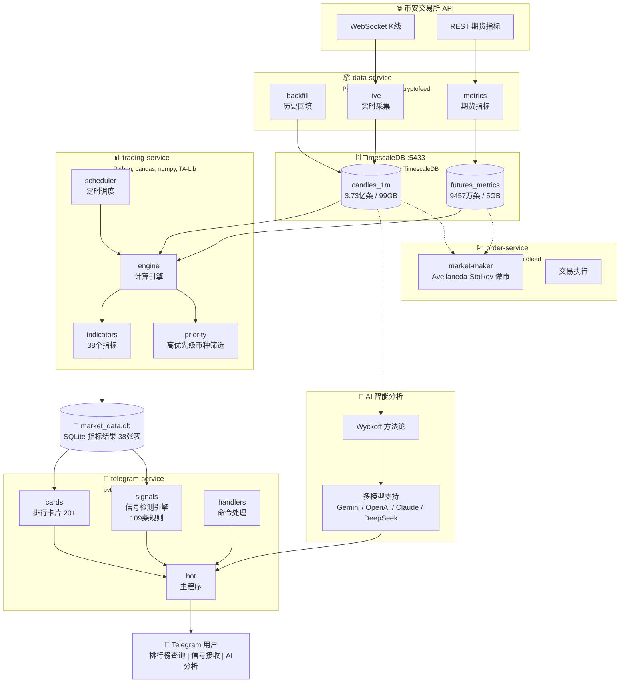
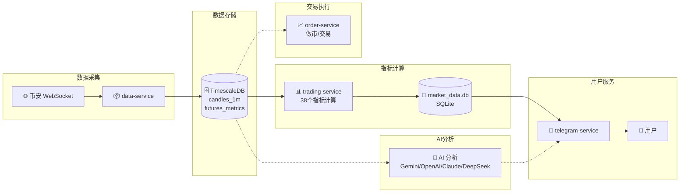

<p align="center">
  
</p>

<div align="center">

# 🐱 交易猫

感谢社区ca给我的资金，让我去完成我的梦想！！！真心感谢你们！！！
<p>
sol：Gysp4iZ6uNuAksAPR37fQwLDRFU9Rz255UjExhiwpump
</p>

<p>
bsc：0x8a99b8d53eff6bc331af529af74ad267f3167777
</p>

本项目为永久开源项目，目前接受且只接受SOL(CA) / BSC(CA) 两个社群的捐赠。交易市场风云变幻，投资请谨慎。

**toy-level 数据分析/交易数据平台**

*全部市场，全部数据，全部方法，分析一切，交易一切，监控一切*

[English](README_EN.md) | 简体中文

[](https://github.com/tukuaiai/tradecat/stargazers)
[](https://github.com/tukuaiai/tradecat/network/members)
[](https://github.com/tukuaiai/tradecat/releases)
[](https://github.com/tukuaiai/tradecat/actions/workflows/ci.yml)
[](LICENSE)

---

<p>
  
  
  
  
  
  
  
  
  
  
  
  
  
  
  
  
  
  
</p>

<p>
  <a href="https://t.me/tradecat_ai_channel"></a>
  <a href="https://t.me/glue_coding"></a>
  <a href="https://x.com/123olp"></a>
</p>

</div>

---

## 📖 目录

- [💰 救救孩子](#-救救孩子)
- [🚀 快速开始](#-快速开始)
- [🏗️ 架构设计](#️-架构设计)
- [✨ 核心特性](#-核心特性)
- [📊 数据与功能](#-数据与功能)
- [📁 目录结构](#-目录结构)
- [🔧 运维指南](#-运维指南)
- [📞 联系方式](#-联系方式)

> 🤖 **从零开始？** 复制这行到 AI 助手：`按照 https://github.com/tukuaiai/tradecat/blob/main/README.md 的说明帮我安装 TradeCat`

---

<details open>
<summary><strong>点击展开👉 💰 救救孩子</strong></summary>

救救孩子，感谢了，好人一生平安🙏🙏🙏

- **币安 UID**: `572155580`
- **Tron (TRC20)**: `TQtBXCSTwLFHjBqTS4rNUp7ufiGx51BRey`
- **Solana**: `HjYhozVf9AQmfv7yv79xSNs6uaEU5oUk2USasYQfUYau`
- **Ethereum (ERC20)**: `0xa396923a71ee7D9480b346a17dDeEb2c0C287BBC`
- **BNB Smart Chain (BEP20)**: `0xa396923a71ee7D9480b346a17dDeEb2c0C287BBC`
- **Bitcoin**: `bc1plslluj3zq3snpnnczplu7ywf37h89dyudqua04pz4txwh8z5z5vsre7nlm`
- **Sui**: `0xb720c98a48c77f2d49d375932b2867e793029e6337f1562522640e4f84203d2e`

</details>

---

<details open>
<summary><strong>点击展开👉 🚀 快速开始</strong></summary>

### 🤖 AI 一键安装（推荐）

> 把下面的提示词复制到 **Claude / ChatGPT / Cursor / Kiro**，AI 会自动执行安装，零人工介入

<details>
<summary><strong>点击展开👉 📋 安装提示词</strong></summary>

```
按照 https://github.com/tukuaiai/tradecat/blob/main/README.md 的说明帮我安装 TradeCat

要求：
1. 读取文档后直接执行安装命令，不要生成脚本
2. 一步一步执行，每步确认成功后继续
3. 遇到错误自动分析并修复
4. 安装完成后运行 ./scripts/verify.sh 验证
5. 全程零人工介入
```

</details>

### 🪟 Windows WSL2 用户

> 📺 **视频教程**: [WSL2 安装配置教程](https://www.bilibili.com/video/BV1n14y1x7Y7/)

先在 Windows 用户目录创建 `.wslconfig`：

```powershell
notepad "$env:USERPROFILE\.wslconfig"
```

写入：

```ini
[wsl2]
memory=10GB
processors=6
swap=12GB
networkingMode=mirrored
```

重启 WSL：`wsl --shutdown`，然后使用上面的 AI 安装提示词。

### ⚙️ 最短可跑通三步

```bash
# 1) 初始化（创建各服务 .venv + 依赖 + 复制配置模板）
./scripts/init.sh

# 2) 填写全局配置（含 BOT_TOKEN / DB / 代理 等）
cp config/.env.example config/.env && chmod 600 config/.env
# 将 DATABASE_URL 端口改为 5433 以与仓库脚本一致（脚本默认 5433，模板默认 5434）
vim config/.env

# 3) 启动核心服务（data + trading + telegram）
./scripts/start.sh start
./scripts/start.sh status
```

> 说明：顶层 `./scripts/start.sh` 仅管理 `data-service`、`trading-service`、`telegram-service`。  
> 其他服务需手动：`cd services/markets-service && ./scripts/start.sh start`（多市场采集）或 `./scripts/crypto-daemon.sh start`（加密货币守护）；`cd services/order-service && python -m src.market-maker.main`（做市，需 API Key）；`ai-service` 作为 Telegram 子模块随 Bot 一起运行；`vis-service` 需手动启动 `uvicorn src.main:app --port 8087`。

### ⚙️ 配置（必须）

- 路径：`config/.env`（已由 init.sh 复制），权限需 600，服务启动脚本会强制校验。  
- TimescaleDB 端口需与脚本一致：仓库脚本默认 5433，模板为 5434，复制后请将 `DATABASE_URL` 改为 5433；若坚持 5434，需同步修改 `scripts/export_timescaledb.sh`、`scripts/timescaledb_compression.sh` 等所有脚本及下方示例端口。
- 核心字段：  
  - `DATABASE_URL`（TimescaleDB，见下方端口说明）  
  - `BOT_TOKEN`（Telegram Bot Token）  
  - `HTTP_PROXY` / `HTTPS_PROXY`（需要代理时填写）  
  - 币种/周期：`SYMBOLS_GROUPS`、`SYMBOLS_EXTRA`、`SYMBOLS_EXCLUDE`、`INTERVALS`、`KLINE_INTERVALS`、`FUTURES_INTERVALS`  
  - 采集/计算开关：`BACKFILL_MODE`/`BACKFILL_DAYS`/`BACKFILL_ON_START`、`MAX_CONCURRENT`、`RATE_LIMIT_PER_MINUTE`  
  - 计算后端：`COMPUTE_BACKEND`、`MAX_WORKERS`、`HIGH_PRIORITY_TOP_N`、`INDICATORS_ENABLED`/`INDICATORS_DISABLED`  
  - 展示过滤：`BINANCE_API_DISABLED`、`DISABLE_SINGLE_TOKEN_QUERY`、`SNAPSHOT_HIDDEN_FIELDS`、`BLOCKED_SYMBOLS`  
  - AI/交易：`AI_INDICATOR_TABLES`、`AI_INDICATOR_TABLES_DISABLED`、`BINANCE_API_KEY`、`BINANCE_API_SECRET`
  - 国际化：`DEFAULT_LOCALE`（默认 zh-CN）、`SUPPORTED_LOCALES`（zh-CN,en）、`FALLBACK_LOCALE`

### 📦 下载历史数据（可选）

从 HuggingFace 下载预置数据集，跳过漫长的历史回填：

🔗 **数据集**: [huggingface.co/datasets/123olp/binance-futures-ohlcv-2018-2026](https://huggingface.co/datasets/123olp/binance-futures-ohlcv-2018-2026)

```bash
# 0. 创建库并导入 schema（依次执行仓库内 SQL）
for f in libs/database/db/schema/*.sql; do
  psql -h localhost -p 5433 -U postgres -d market_data -f "$f"
done

# 1. 导入 K线数据 (3.73亿条)
zstd -d candles_1m.bin.zst -c | psql -h localhost -p 5433 -U postgres -d market_data \
  -c "COPY market_data.candles_1m FROM STDIN WITH (FORMAT binary)"

# 2. 导入期货数据 (9457万条)
zstd -d futures_metrics_5m.bin.zst -c | psql -h localhost -p 5433 -U postgres -d market_data \
  -c "COPY market_data.binance_futures_metrics_5m FROM STDIN WITH (FORMAT binary)"
```

> 端口说明：模板默认 5434，但仓库脚本默认 5433。复制后请在 `config/.env` 中把 `DATABASE_URL` 端口改为 5433，或若选择 5434，则务必同步修改 `scripts/export_timescaledb.sh`、`scripts/timescaledb_compression.sh` 与所有示例命令端口。

## 🔍 补充检查（2026-01-06）

- 端口分歧仍需一次性决策：核心脚本 `scripts/export_timescaledb.sh`、`scripts/timescaledb_compression.sh` 默认 5433；模板 `config/.env.example` 及 `services/markets-service/scripts/init_market_db.sh`/`import_bookdepth.py`/`sync_from_old_db.sh`/`ddl/01_enums_schemas.sql`/`migrate_5434.sql` 默认 5434（新库）。请选定端口后同步修改上述所有文件与 README 示例命令。<!-- TODO: 选择统一端口（5433 或 5434）并执行全局替换 -->
- CI 仅执行 ruff + py_compile 抽样（`.github/workflows/ci.yml`），不会跑 tests；提交前本地仍需 `./scripts/verify.sh`。
- `scripts/install.sh` 生成各服务 `.env` 但运行时只读 `config/.env`；避免多份配置漂移。

### 🗄️ 双库端口说明（旧库 5433 / 新库 5434）

- 旧库（5433，单 schema `market_data`）：与早期数据采集链兼容，仍被 `scripts/export_timescaledb.sh` / `scripts/timescaledb_compression.sh` 及多数示例命令使用。
- 新库（5434，多 schema `raw` / `agg` / `quality`）：`config/.env.example`、markets-service 的初始化与迁移脚本（`init_market_db.sh`、`sync_from_old_db.sh`、`migrate_5434.sql` 等）默认指向此库。
- 使用原则：  
  - 继续沿用旧库：保持 `DATABASE_URL` 5433，并将 markets-service 脚本端口改为 5433。  
  - 切换到新库：保持 5434，同时修改顶层运维脚本与 README 示例端口为 5434，确保存储/压缩/导出脚本一致。  
- 混用风险：脚本与服务若指向不同端口会造成数据分叉；变更前先备份 `./scripts/export_timescaledb.sh`（当前默认 5433）。<!-- TODO: 若正式迁移到 5434，请提供统一替换列表与执行顺序 -->

### ✅ 验证安装

```bash
./scripts/verify.sh
```

---

<details>
<summary><strong>点击展开👉 📖 手动安装步骤</strong></summary>

### 环境要求

| 依赖 | 版本 | 说明 |
|:---|:---|:---|
| Python | 3.10+ | 推荐 3.12 |
| PostgreSQL | 16+ | 需安装 TimescaleDB 扩展 |
| TA-Lib | 0.4+ | 系统级库，需单独安装 |
| SQLite | 3.x | 系统自带 |

### 安装步骤

#### 1. 克隆仓库

```bash
git clone https://github.com/tukuaiai/tradecat.git
cd tradecat
```

#### 2. 安装系统依赖

```bash
# Ubuntu/Debian
sudo apt-get update
sudo apt-get install -y build-essential python3-dev

# 安装 TA-Lib
wget http://prdownloads.sourceforge.net/ta-lib/ta-lib-0.4.0-src.tar.gz
tar -xzf ta-lib-0.4.0-src.tar.gz
cd ta-lib && ./configure --prefix=/usr && make && sudo make install
cd .. && rm -rf ta-lib ta-lib-0.4.0-src.tar.gz
```

#### 3. 一键初始化

```bash
# 初始化所有服务（创建虚拟环境、安装依赖、复制配置）
./scripts/init.sh

# 或单独初始化某个服务
./scripts/init.sh data-service
```

#### 4. 配置环境变量

```bash
# 编辑 `config/.env`（init.sh 已自动从 .env.example 复制；请同步端口为 5433 以与脚本一致）
vim config/.env
```

#### 5. 启动服务

```bash
# 启动所有服务
./scripts/start.sh start

# 查看状态
./scripts/start.sh status

# 停止全部
./scripts/start.sh stop
```

#### 6. 验证安装

```bash
./scripts/verify.sh
```

</details>

</details>

---

<details>
<summary><strong>点击展开👉 ✨ 核心特性</strong></summary>

<table>
<tr>
<td width="50%">

### 🔄 多市场数据采集
- **加密货币** - CCXT (100+交易所) + Cryptofeed (WebSocket)
- **A股市场** - AKShare + BaoStock (免费全量)
- **美股/全球** - yfinance + pandas-datareader
- **宏观经济** - FRED API (美联储官方)
- **数据聚合** - OpenBB (100+数据源)

</td>
<td width="50%">

### 📊 38个技术指标
- **趋势指标** - EMA/MACD/SuperTrend/ADX/Ichimoku
- **动量指标** - RSI/KDJ/CCI/MFI/WilliamsR
- **波动指标** - 布林带/ATR/Keltner/支撑阻力
- **形态识别** - TA-Lib 61种蜡烛 + 价格形态

</td>
</tr>
<tr>
<td width="50%">

### 🤖 Telegram Bot
- **实时排行榜** - 20+ 种排行卡片
- **信号推送** - 形态突破、指标异常
- **交互查询** - 单币详情、多周期面板
- **AI 分析** - Wyckoff 深度市场分析

</td>
<td width="50%">

### 🗄️ 海量数据存储
- **K线数据** - 3.73亿条 (2018-至今)
- **期货数据** - 9457万条 (2021-至今)
- **存储引擎** - TimescaleDB 时序优化
- **衍生品定价** - QuantLib 期权/债券

</td>
</tr>
<tr>
<td width="50%">

### 🧠 AI 智能分析
- **Wyckoff 方法论** - 市场结构、供需区间、阶段判断
- **多模型支持** - Gemini / OpenAI / Claude / DeepSeek
- **专业提示词** - 内置交易分析师角色 Prompt
- **上下文增强** - 自动注入实时 K线/指标/期货数据

</td>
<td width="50%">

### 🔔 信号检测引擎
- **109条规则** - 覆盖35张指标表
- **多维度检测** - 趋势/动量/形态/期货
- **订阅管理** - 用户自定义推送偏好
- **冷却机制** - 防止重复推送

</td>
</tr>
</table>

</details>

---

<details open>
<summary><strong>点击展开👉 🏗️ 架构设计</strong></summary>

### 系统架构图



### 服务说明

| 服务 | 端口 | 职责 | 技术栈 |
|:---|:---:|:---|:---|
| **data-service** | - | 加密货币 K线采集、期货指标采集、历史数据回填 | Python, asyncio, ccxt, cryptofeed |
| **markets-service** | - | 全市场数据采集（美股/A股/宏观/衍生品定价） | yfinance, akshare, fredapi, QuantLib |
| **trading-service** | - | 38个技术指标计算、高优先级币种筛选、定时调度 | Python, pandas, numpy, TA-Lib |
| **telegram-service** | - | Bot 交互、排行榜展示、信号推送 | python-telegram-bot, aiohttp |
| **ai-service** | - | AI 分析、Wyckoff 方法论（作为 telegram-service 子模块） | Gemini/OpenAI/Claude/DeepSeek |
| **order-service** | - | 交易执行、Avellaneda-Stoikov 做市 | Python, ccxt, cryptofeed |
| **TimescaleDB** | 5433 | K线存储、期货数据存储、时序查询优化 | PostgreSQL 16 + TimescaleDB |

### 数据流向



</details>

---

<details>
<summary><strong>点击展开👉 📊 数据与功能</strong></summary>

### 📊 数据规模

**🔗 历史数据下载**: [HuggingFace 数据集](https://huggingface.co/datasets/123olp/binance-futures-ohlcv-2018-2026)

| 数据集 | 说明 | 大小 |
|:---|:---|:---|
| `candles_1m.bin.zst` | K线数据 (2018-至今, 3.73亿条) | ~15 GB |
| `futures_metrics_5m.bin.zst` | 期货指标 (2021-至今, 9457万条) | ~800 MB |

<details>
<summary><strong>点击展开👉 📋 数据详情与导入步骤</strong></summary>

### 数据概览

<table>
<tr>
<td width="50%">

#### 📈 K线数据 (candles_1m)

| 指标 | 数值 |
|:---|---:|
| **总记录数** | 373,342,599 |
| **币种数量** | 615 |
| **时间范围** | 2018-01-01 ~ 至今 |
| **存储大小** | 99 GB |
| **压缩后** | ~15 GB (zstd) |

**字段说明**:
- `bucket_ts` - K线时间戳
- `open/high/low/close` - OHLC 价格
- `volume` - 成交量
- `quote_volume` - 成交额 (USDT)
- `taker_buy_volume` - 主动买入量

</td>
<td width="50%">

#### 📊 期货数据 (futures_metrics_5m)

| 指标 | 数值 |
|:---|---:|
| **总记录数** | 94,576,458 |
| **币种数量** | 612 |
| **时间范围** | 2021-12-01 ~ 至今 |
| **存储大小** | 5 GB |
| **压缩后** | ~800 MB (zstd) |

**字段说明**:
- `sum_open_interest` - 持仓量
- `sum_open_interest_value` - 持仓价值 (USDT)
- `sum_toptrader_long_short_ratio` - 大户多空比
- `sum_taker_long_short_vol_ratio` - 主动买卖比

</td>
</tr>
</table>

### 数据更新频率

| 数据类型 | 更新频率 | 延迟 |
|:---|:---|:---|
| K线 (1m) | 实时 WebSocket | < 5秒 |
| K线 (5m/15m/1h/4h/1d/1w) | 聚合计算 | < 10秒 |
| 期货指标 | 每 5 分钟 | < 30秒 |
| 技术指标 | 每分钟轮询 | < 3分钟 |

### 导入步骤

```bash
# 1. 下载数据文件
# 从 HuggingFace 下载 .bin.zst 文件到 backups/timescaledb/

# 2. 恢复表结构
zstd -d schema.sql.zst -c | psql -h localhost -p 5433 -U postgres -d market_data

# 3. 导入 K线数据
zstd -d candles_1m.bin.zst -c | psql -h localhost -p 5433 -U postgres -d market_data \
    -c "COPY market_data.candles_1m FROM STDIN WITH (FORMAT binary)"

# 4. 导入期货数据
zstd -d futures_metrics_5m.bin.zst -c | psql -h localhost -p 5433 -U postgres -d market_data \
    -c "COPY market_data.binance_futures_metrics_5m FROM STDIN WITH (FORMAT binary)"
```

> 💡 导入后即可使用 trading-service 计算指标，无需从头采集历史数据。

</details>

### 📈 技术指标

<details>
<summary><strong>点击展开👉 🔥 趋势指标 (8个)</strong></summary>

| 指标 | 说明 | 参数 |
|:---|:---|:---|
| **EMA** | 指数移动平均 | 7/25/99 周期 |
| **MACD** | 异同移动平均 | 12/26/9 |
| **SuperTrend** | 超级趋势 | ATR 周期 10, 乘数 3 |
| **ADX** | 平均趋向指数 | 14 周期 |
| **Ichimoku** | 一目均衡表 | 9/26/52 |
| **Donchian** | 唐奇安通道 | 20 周期 |
| **Keltner** | 肯特纳通道 | 20 周期, ATR 2倍 |
| **趋势线** | 自动趋势线识别 | 动态计算 |

</details>

<details>
<summary><strong>点击展开👉 📊 动量指标 (6个)</strong></summary>

| 指标 | 说明 | 参数 |
|:---|:---|:---|
| **RSI** | 相对强弱指数 | 14 周期 |
| **KDJ** | 随机指标 | 9/3/3 |
| **CCI** | 商品通道指数 | 20 周期 |
| **WilliamsR** | 威廉指标 | 14 周期 |
| **MFI** | 资金流量指数 | 14 周期 |
| **RSI谐波** | RSI 背离检测 | 14 周期 |

</details>

<details>
<summary><strong>点击展开👉 📉 波动指标 (4个)</strong></summary>

| 指标 | 说明 | 参数 |
|:---|:---|:---|
| **布林带** | Bollinger Bands | 20 周期, 2倍标准差 |
| **ATR** | 真实波幅 | 14 周期 |
| **ATR波幅** | 波动率排行 | 14 周期 |
| **支撑阻力** | 关键价位识别 | 动态计算 |

</details>

<details>
<summary><strong>点击展开👉 📦 成交量指标 (6个)</strong></summary>

| 指标 | 说明 | 用途 |
|:---|:---|:---|
| **OBV** | 能量潮 | 量价背离 |
| **CVD** | 累积成交量差 | 买卖力量 |
| **VWAP** | 成交量加权均价 | 机构成本 |
| **成交量比率** | 相对成交量 | 放量识别 |
| **流动性** | 买卖盘深度 | 滑点预估 |
| **VPVR** | 成交量分布 | 密集成交区 |

</details>

<details>
<summary><strong>点击展开👉 🕯️ K线形态 (61+种)</strong></summary>

**蜡烛形态 (TA-Lib, 61种)**

| 类型 | 形态 |
|:---|:---|
| **反转形态** | 锤子线、上吊线、吞没、孕线、晨星、黄昏星、三只乌鸦 |
| **持续形态** | 三法、分离线、并列阴阳 |
| **中性形态** | 十字星、纺锤线、高浪线 |

**价格形态 (patternpy)**

| 类型 | 形态 | 信号 |
|:---|:---|:---|
| **头肩形态** | 头肩顶、头肩底 | 强反转 |
| **双重形态** | 双顶、双底 | 中等反转 |
| **三角形态** | 上升三角、下降三角、对称三角 | 突破方向 |
| **楔形形态** | 上升楔形、下降楔形 | 反向突破 |
| **通道形态** | 上升通道、下降通道、水平通道 | 趋势延续 |

</details>

<details>
<summary><strong>点击展开👉 📡 期货指标 (8个)</strong></summary>

| 指标 | 说明 | 信号含义 |
|:---|:---|:---|
| **持仓量** | Open Interest | 市场参与度 |
| **持仓价值** | OI Value (USDT) | 资金规模 |
| **多空比** | Long/Short Ratio | 散户情绪 |
| **大户多空比** | Top Trader L/S | 主力方向 |
| **主动买卖比** | Taker Buy/Sell | 即时情绪 |
| **资金费率** | Funding Rate | 多空成本 |
| **爆仓数据** | Liquidations | 极端行情 |
| **期货情绪聚合** | 综合评分 | 多维度分析 |

</details>

### 高优先级算法

系统自动识别高优先级币种 (约 130-150 个)，基于以下维度：

```
高优先级 = K线维度 ∪ 期货维度

K线维度:
  - 成交额 Top 50
  - 波动率 Top 30  
  - 涨跌幅 Top 30

期货维度:
  - 持仓价值 Top 30
  - 主动买卖比极端 (>1.5 或 <0.67)
  - 多空比极端 (>2.0 或 <0.5)
```

### 🤖 Telegram Bot

#### 功能概览

<table>
<tr>
<td width="50%">

##### 📊 排行榜卡片 (20+种)

| 类别 | 卡片 |
|:---|:---|
| **基础排行** | RSI、MACD、KDJ、布林带、OBV |
| **高级排行** | EMA、ATR、CVD、MFI、VWAP、流动性 |
| **形态排行** | K线形态、支撑阻力、趋势线 |
| **期货排行** | 持仓量、多空比、主动买卖比 |

</td>
<td width="50%">

#### 🔔 信号推送

| 信号类型 | 触发条件 |
|:---|:---|
| **形态突破** | 检测到头肩、双顶等形态 |
| **指标异常** | RSI 超买超卖、MACD 金叉死叉 |
| **量价异动** | 成交量突增、价格突破 |
| **期货异常** | 多空比极端、持仓量剧变 |

</td>
</tr>
</table>

### 命令与触发方式

| 触发方式 | 功能 | 说明 |
|:---|:---|:---|
| `BTC!` | 单币查询 | 交互式多面板查看 |
| `BTC!!` | 完整TXT导出 | 下载 psql 风格完整报告 |
| `BTC@` | AI分析 | 威科夫深度市场分析 |
| `/data` | 数据面板 | 访问排行榜卡片 |
| `/ai` | AI分析 | 进入AI币种选择 |
| `/query` | 币种查询 | 显示可查询币种 |
| `/help` | 帮助 | 使用说明 |

</details>

---

<details>
<summary><strong>点击展开👉 📁 目录结构</strong></summary>

```
tradecat/
│
├── 📂 config/                      # 统一配置（所有服务共用）
│   ├── .env                        # 生产配置（含密钥，不提交）
│   ├── .env.example                # 配置模板
│   └── logrotate.conf              # 日志轮转
│
├── 📂 scripts/                     # 全局脚本
│   ├── install.sh                  # 一键安装
│   ├── init.sh                     # 初始化脚本
│   ├── start.sh                    # 统一启动/守护脚本
│   ├── verify.sh                   # 验证脚本
│   ├── export_timescaledb.sh       # 数据导出
│   └── timescaledb_compression.sh  # 压缩管理
│
├── 📂 services/                    # 微服务目录 (8个)
│   │
│   ├── 📂 data-service/            # 加密货币数据采集服务
│   │   ├── 📂 src/
│   │   │   ├── 📂 collectors/      # 采集器
│   │   │   ├── 📂 adapters/        # 适配器
│   │   │   └── config.py
│   │   ├── 📂 scripts/
│   │   ├── requirements.txt
│   │   └── requirements.lock.txt
│   │
│   ├── 📂 markets-service/         # 全市场数据采集服务（美股/A股/宏观）
│   │   ├── 📂 src/
│   │   │   ├── 📂 providers/       # 数据源适配器 (8个)
│   │   │   ├── 📂 collectors/      # 采集任务调度
│   │   │   ├── 📂 models/          # 标准化数据模型
│   │   │   └── 📂 core/            # 核心框架
│   │   ├── 📂 scripts/
│   │   ├── requirements.txt
│   │   └── requirements.lock.txt
│   │
│   ├── 📂 trading-service/         # 指标计算服务
│   │   ├── 📂 src/
│   │   │   ├── 📂 indicators/      # 38个指标
│   │   │   ├── 📂 core/            # 计算引擎
│   │   │   └── simple_scheduler.py
│   │   ├── 📂 scripts/
│   │   ├── requirements.txt
│   │   └── requirements.lock.txt
│   │
│   ├── 📂 telegram-service/        # Telegram Bot
│   │   ├── 📂 src/
│   │   │   ├── 📂 cards/           # 排行榜卡片
│   │   │   ├── 📂 signals/         # 信号检测引擎
│   │   │   ├── 📂 bot/             # Bot 主程序
│   │   │   └── main.py
│   │   ├── 📂 scripts/
│   │   ├── requirements.txt
│   │   └── requirements.lock.txt
│   │
│   ├── 📂 ai-service/              # AI 分析服务
│   │   ├── 📂 src/
│   │   │   ├── 📂 data/            # 数据获取
│   │   │   ├── 📂 llm/             # LLM 客户端
│   │   │   ├── 📂 prompt/          # Prompt 管理
│   │   │   └── 📂 bot/             # Bot 集成
│   │   ├── 📂 prompts/             # Prompt 模板
│   │   ├── 📂 scripts/
│   │   └── requirements.txt
│   │
│   ├── 📂 predict-service/         # 预测市场信号微服务
│   │   └── 📂 docs/                # 需求/设计/ADR/Prompt 文档入口
│   │
│   ├── 📂 vis-service/             # 可视化渲染服务（新）
│   │   ├── 📂 src/                 # FastAPI 入口与模板渲染
│   │   ├── 📂 scripts/             # 启动脚本
│   │   └── requirements.txt
│   │
│   └── 📂 order-service/           # 交易执行服务
│       ├── 📂 src/
│       │   └── 📂 market-maker/    # A-S 做市系统
│       ├── requirements.txt
│       └── requirements.lock.txt
│
├── 📂 libs/                        # 共享库
│   ├── 📂 database/                # 数据库文件
│   │   └── 📂 services/telegram-service/
│   │       └── market_data.db      # SQLite 指标数据
│   └── 📂 common/                  # 共享工具
│       ├── symbols.py              # 币种管理模块
│       └── proxy_manager.py        # 代理管理器
│
├── 📂 backups/                     # 备份目录
│   └── 📂 timescaledb/             # 数据库备份
│
├── Makefile                        # 常用命令
├── README.md                       # 项目说明
├── AGENTS.md                       # AI Agent 指南
└── CONTRIBUTING.md                 # 贡献指南
```

</details>

---

<details>
<summary><strong>点击展开👉 🔧 运维指南</strong></summary>

### 服务管理

<details>
<summary><strong>点击展开👉 统一管理（推荐）</strong></summary>

```bash
# 启动所有服务
./scripts/start.sh start

# 查看状态
./scripts/start.sh status

# 停止全部
./scripts/start.sh stop

# 重启
./scripts/start.sh restart
```

</details>

<details>
<summary><strong>点击展开👉 单服务管理</strong></summary>

```bash
# data-service
cd services/data-service
./scripts/start.sh daemon   # 启动 + 守护
./scripts/start.sh start    # 仅启动
./scripts/start.sh stop     # 停止
./scripts/start.sh status   # 状态

# trading-service / telegram-service 同上
```

</details>

<details>
<summary><strong>点击展开👉 初始化</strong></summary>

```bash
# 初始化全部服务
./scripts/init.sh

# 初始化单个服务
./scripts/init.sh data-service
```

</details>

<details>
<summary><strong>点击展开👉 验证与检查</strong></summary>

```bash
./scripts/verify.sh
```

</details>

<details>
<summary><strong>点击展开👉 查看日志</strong></summary>

```bash
# data-service 日志
tail -f services/data-service/logs/backfill.log
tail -f services/data-service/logs/ws_klines.log
tail -f services/data-service/logs/metrics.log

# trading-service 日志
tail -f services/trading-service/logs/simple_scheduler.log

# telegram-service 日志
tail -f services/telegram-service/logs/bot.log

# 守护进程日志
tail -f daemon.log
```

</details>

<details>
<summary><strong>点击展开👉 进程监控</strong></summary>

```bash
# 查看所有相关进程
ps aux | grep -E "data-service|trading-service|telegram|simple_scheduler"

# 查看资源占用
htop -p $(pgrep -d',' -f "simple_scheduler|crypto_trading")
```

</details>

### 数据库操作

<details>
<summary><strong>点击展开👉 TimescaleDB 查询</strong></summary>

```bash
# 连接数据库
PGPASSWORD=postgres psql -h localhost -p 5433 -U postgres -d market_data

# 常用查询
-- K线数据量
SELECT COUNT(*) FROM market_data.candles_1m;

-- 最新数据时间
SELECT MAX(bucket_ts) FROM market_data.candles_1m;

-- 币种列表
SELECT DISTINCT symbol FROM market_data.candles_1m ORDER BY symbol;

-- 单币种数据
SELECT * FROM market_data.candles_1m 
WHERE symbol = 'BTCUSDT' 
ORDER BY bucket_ts DESC LIMIT 10;
```

</details>

<details>
<summary><strong>点击展开👉 SQLite 查询</strong></summary>

```bash
# 连接数据库
sqlite3 libs/database/services/telegram-service/market_data.db

# 常用查询
.tables                          -- 查看所有表
.schema "K线形态扫描器.py"        -- 查看表结构

-- 查看形态数据
SELECT * FROM "K线形态扫描器.py" 
WHERE 形态类型 LIKE '%头肩%' 
LIMIT 10;
```

</details>

### 数据备份

<details>
<summary><strong>点击展开👉 导出 TimescaleDB</strong></summary>

```bash
# 运行导出脚本 (后台执行)
nohup ./scripts/export_timescaledb.sh &

# 查看进度
tail -f backups/timescaledb/export.log
ls -lh backups/timescaledb/

# 输出文件:
# - candles_1m_*.bin.zst      (~15GB, K线数据)
# - futures_metrics_*.bin.zst (~800MB, 期货数据)
# - schema_*.sql.zst          (表结构)
# - restore_*.sh              (恢复脚本)
```

</details>

<details>
<summary><strong>点击展开👉 恢复数据</strong></summary>

```bash
cd backups/timescaledb

# 恢复 schema
zstd -d schema_*.sql.zst -c | psql -h localhost -p 5433 -U postgres -d market_data

# 恢复 K线数据
zstd -d candles_1m_*.bin.zst -c | psql -h localhost -p 5433 -U postgres -d market_data \
    -c "COPY market_data.candles_1m FROM STDIN WITH (FORMAT binary)"

# 恢复期货数据
zstd -d futures_metrics_*.bin.zst -c | psql -h localhost -p 5433 -U postgres -d market_data \
    -c "COPY market_data.binance_futures_metrics_5m FROM STDIN WITH (FORMAT binary)"
```

</details>

### 常见问题

<details>
<summary><strong>点击展开👉 Q: TA-Lib 安装失败？</strong></summary>

```bash
# 确保先安装系统库
sudo apt-get install -y build-essential

# 下载并编译 TA-Lib
wget http://prdownloads.sourceforge.net/ta-lib/ta-lib-0.4.0-src.tar.gz
tar -xzf ta-lib-0.4.0-src.tar.gz
cd ta-lib
./configure --prefix=/usr
make
sudo make install

# 然后安装 Python 包
pip install TA-Lib
```

</details>

<details>
<summary><strong>点击展开👉 Q: K线形态显示"无形态"？</strong></summary>

```bash
# 检查 TA-Lib 是否安装
python -c "import talib; print(talib.__version__)"

# 检查形态库是否安装
pip install m-patternpy
pip install tradingpattern --no-deps

# 重启 trading-service
cd services/trading-service
./scripts/start.sh restart
```

</details>

<details>
<summary><strong>点击展开👉 Q: 数据库连接失败？</strong></summary>

```bash
# 检查 PostgreSQL 是否运行
sudo systemctl status postgresql

# 检查端口
ss -tlnp | grep 5433

# 检查连接
PGPASSWORD=postgres psql -h localhost -p 5433 -U postgres -c "\l"
```

</details>

</details>

---

<details open>
<summary><strong>点击展开👉 📞 联系方式</strong></summary>

- **Telegram 频道**: [tradecat_ai_channel](https://t.me/tradecat_ai_channel)
- **Telegram 交流群**: [glue_coding](https://t.me/glue_coding)
- **Twitter/X**: [123olp](https://x.com/123olp)
- **Twitter/X**: [123olp](https://x.com/123olp)
- **discord**:  [tradecat](https://discord.gg/nppHyjrfqX)

</details>

---

## 📜 许可证

本项目采用 [MIT License](LICENSE) 开源许可证。

---

## Star History

<a href="https://www.star-history.com/#tukuaiai/tradecat&type=date&legend=top-left">
 <picture>
   <source media="(prefers-color-scheme: dark)" srcset="https://api.star-history.com/svg?repos=tukuaiai/tradecat&type=date&theme=dark&legend=top-left" />
   <source media="(prefers-color-scheme: light)" srcset="https://api.star-history.com/svg?repos=tukuaiai/tradecat&type=date&legend=top-left" />
   
 </picture>
</a>

---

<div align="center">

### ⭐ 如果这个项目对您有帮助，请点亮 Star！

---

**Made with ❤️ by [tukuaiai](https://github.com/tukuaiai)**

[⬆ 返回顶部](#-tradecat)

</div>
