<p align="center">
  
</p>

<div align="center">

# 🐱 TradeCat

This project's AI repository (may not be entirely accurate): https://zread.ai/tukuaiai/tradecat

Community-funded open-source project. Thanks for the support!  
Donations (optional):
<p>
Solana(For CA tokens, please do not transfer directly; otherwise, your assets will be lost.)
: Gysp4iZ6uNuAksAPR37fQwLDRFU9Rz255UjExhiwpump
</p>

<p>
BSC (BEP20)(For CA tokens, please do not transfer directly; otherwise, your assets will be lost.)
: 0x8a99b8d53eff6bc331af529af74ad267f3167777
</p>

**Disclaimer**

1. **Open-source & non-official statement**: This project is permanently open-source. Anyone may use, distribute, and develop derivatives within the scope of the open-source license. This project is not affiliated with any exchange, fund, market maker, or official organization.

2. **Not investment advice**: This project and its related content are provided solely for technical research and community collaboration/communication. They do not constitute investment advice, financial advice, or trading advice of any kind. Digital asset prices are highly volatile and may fall to zero; please assess risks independently and make your own decisions.

3. **No token issuance / no endorsement**: This project does not issue any tokens. Any issuance, promotion, price manipulation, fundraising, or return guarantees made in this project’s name are unrelated to this project. Any on-chain assets (if any) are third-party actions; participation is at your own risk.

4. **Donation statement (only channels)**: At present, this project accepts donations **only** from two communities: **SOL (Gysp4iZ6uNuAksAPR37fQwLDRFU9Rz255UjExhiwpump)** and **BSC (0x8a99b8d53eff6bc331af529af74ad267f3167777)**. Donations are voluntary and provide no returns or profit promises.

5. **Public addresses & risk notice**: My addresses are publicly disclosed. Please verify the correct chain, network, and address yourself. Transfers are generally irreversible once made. Any losses caused by sending to the wrong address, scams, account compromise, impersonation, etc. are borne solely by the sender.

6. **Limitation of liability**: To the maximum extent permitted by law, the project maintainers/contributors are not liable for any direct or indirect losses, including but not limited to investment losses, trading losses, contract risks, phishing scams, smart contract vulnerabilities, or third-party service failures.

7. **Historical matters**: Any issues involving the original developer (“dev”) or historical fund disputes are actions of historical parties. The current project maintainer bears no responsibility for any third party’s past conduct.

Markets change rapidly. Invest cautiously. I did not issue the coin. These are publicly disclosed addresses. If you lose money, please don’t insult me—I’m scared; I’m sensitive 🙏🙏🙏. The original dev already ran off with the funds 😅😅😅.

My cryptocurrency address

sol：`HjYhozVf9AQmfv7yv79xSNs6uaEU5oUk2USasYQfUYau`

bsc：`0xa396923a71ee7D9480b346a17dDeEb2c0C287BBC`,`0x60c062e7600f74079ea7b5e5568edfb9a3f61f0f`

*Toy-level data analysis / trading data platform*

**Toy-level Data Analysis / Trading Data Platform**

*All markets, all data, all methods - analyze everything, trade everything, monitor everything*

[简体中文](README.md) | English

[](https://github.com/tukuaiai/tradecat/stargazers)
[](https://github.com/tukuaiai/tradecat/network/members)
[](https://github.com/tukuaiai/tradecat/releases)
[](https://github.com/tukuaiai/tradecat/actions/workflows/ci.yml)
[](LICENSE)

---

<p>
  
  
  
  
  
  
  
  
  
  
  
  
  
  
  
  
  
  
</p>

<p>
  <a href="https://t.me/tradecat_ai_channel"></a>
  <a href="https://t.me/glue_coding"></a>
  <a href="https://x.com/123olp"></a>
</p>

</div>

---

## 📖 Table of Contents

- [💰 Support](#-support)
- [🚀 Quick Start](#-quick-start)
- [🏗️ Architecture](#️-architecture)
- [✨ Features](#-features)
- [📊 Data & Functions](#-data--functions)
- [📁 Directory Structure](#-directory-structure)
- [🔧 Operations Guide](#-operations-guide)
- [📞 Contact](#-contact)

> 🤖 **Starting from scratch?** Copy this to your AI assistant: `Follow the instructions at https://github.com/tukuaiai/tradecat/blob/main/README.md to install TradeCat`

---

<details open>
<summary><strong>Expand👉 💰 Support</strong></summary>

If this project helps you, please consider supporting 🙏

- **Binance UID**: `572155580`
- **Tron (TRC20)**: `TQtBXCSTwLFHjBqTS4rNUp7ufiGx51BRey`
- **Solana**: `HjYhozVf9AQmfv7yv79xSNs6uaEU5oUk2USasYQfUYau`
- **Ethereum (ERC20)**: `0xa396923a71ee7D9480b346a17dDeEb2c0C287BBC`
- **BNB Smart Chain (BEP20)**: `0xa396923a71ee7D9480b346a17dDeEb2c0C287BBC`
- **Bitcoin**: `bc1plslluj3zq3snpnnczplu7ywf37h89dyudqua04pz4txwh8z5z5vsre7nlm`
- **Sui**: `0xb720c98a48c77f2d49d375932b2867e793029e6337f1562522640e4f84203d2e`

</details>

---

<details open>
<summary><strong>Expand👉 🚀 Quick Start</strong></summary>

### 🤖 AI One-Click Install (Recommended)

> Copy the prompt below to **Claude / ChatGPT / Cursor / Kiro**, AI will automatically execute installation with zero manual intervention

**Method 1: Complete Deployment Prompt (Recommended)**

📄 **[docs/DEPLOY_PROMPT.md](docs/DEPLOY_PROMPT.md)** - Contains detailed 10-step deployment process:
- Auto system dependencies installation
- Service initialization and configuration
- HuggingFace historical data auto download & import
- Daemon process and log rotation setup
- Complete troubleshooting guide

Copy the file content to AI assistant for fully automated deployment.

<details>
<summary><strong>Expand👉 📋 Simplified Installation Prompt</strong></summary>

```
Follow the instructions at https://github.com/tukuaiai/tradecat/blob/main/README.md to install TradeCat

Requirements:
1. Execute installation commands directly after reading the docs, don't generate scripts
2. Execute step by step, continue after confirming each step succeeds
3. Automatically analyze and fix errors
4. Run ./scripts/verify.sh to verify after installation
5. Zero manual intervention throughout
```

</details>

### 🪟 Windows WSL2 Users

> 📺 **Video Tutorial**: [WSL2 Installation Guide](https://www.bilibili.com/video/BV1n14y1x7Y7/)

Create `.wslconfig` in Windows user directory:

```powershell
notepad "$env:USERPROFILE\.wslconfig"
```

Write:

```ini
[wsl2]
memory=10GB
processors=6
swap=12GB
networkingMode=mirrored
```

Restart WSL: `wsl --shutdown`, then use the AI installation prompt above.

### ⚙️ Fastest path (3 steps)

```bash
# 1) Init (create per-service .venv, install deps, copy config)
./scripts/init.sh

# 2) Fill global config (DB / BOT_TOKEN / proxy)
cp config/.env.example config/.env && chmod 600 config/.env
# Change DATABASE_URL port to 5433 to match repo scripts (scripts default 5433, template defaults 5434)
vim config/.env

# 3) Start core services (data + trading + telegram)
./scripts/start.sh start
./scripts/start.sh status
```

> Note: top-level `./scripts/start.sh` only manages `data-service`, `trading-service`, `telegram-service`.  
> Preview services are manual: `cd services-preview/markets-service && ./scripts/start.sh start` (multi-market); `cd services-preview/order-service && python -m src.market-maker.main` (market making, API key required); `ai-service` runs as a Telegram sub-module; `cd services-preview/vis-service && ./scripts/start.sh start` (visualization, port 8087).

### ⚙️ Configuration (required)

- Location: `config/.env` (copied by init.sh), must be chmod 600, startup scripts will enforce this.  
- TimescaleDB port must match scripts: repo scripts default to 5433, template defaults to 5434. After copying, change `DATABASE_URL` to 5433; or if keeping 5434, update `scripts/export_timescaledb.sh`, `scripts/timescaledb_compression.sh` and all example ports below.
- Key fields:  
  - `DATABASE_URL` (TimescaleDB, see port note below)  
  - `BOT_TOKEN` (Telegram Bot Token)  
  - `TELEGRAM_GROUP_WHITELIST` (comma-separated group IDs; empty = private chats only; group messages require `/` or `!` prefix + @bot mention)  
  - `HTTP_PROXY` / `HTTPS_PROXY` (if proxy needed)  
  - Symbols/intervals: `SYMBOLS_GROUPS`, `SYMBOLS_EXTRA`, `SYMBOLS_EXCLUDE`, `INTERVALS`, `KLINE_INTERVALS`, `FUTURES_INTERVALS`  
  - Collection/compute: `BACKFILL_MODE`/`BACKFILL_DAYS`/`BACKFILL_ON_START`, `MAX_CONCURRENT`, `RATE_LIMIT_PER_MINUTE`  
  - Defaults: `BACKFILL_MODE=all` (full backfill; if `BACKFILL_START_DATE` is set, calculates days from start date; otherwise ~10 years), `SYMBOLS_GROUPS=main4` (only BTC/ETH/SOL/BNB; for full market use `all` or custom groups)  
  - Compute backend: `COMPUTE_BACKEND`, `MAX_WORKERS`, `HIGH_PRIORITY_TOP_N`, `INDICATORS_ENABLED`/`INDICATORS_DISABLED`  
  - Display/filter: `BINANCE_API_DISABLED`, `DISABLE_SINGLE_TOKEN_QUERY`, `SNAPSHOT_HIDDEN_FIELDS`, `BLOCKED_SYMBOLS`  
  - AI/Trading: `AI_INDICATOR_TABLES`, `AI_INDICATOR_TABLES_DISABLED`, `BINANCE_API_KEY`, `BINANCE_API_SECRET`
  - i18n: `DEFAULT_LOCALE` (default en), `SUPPORTED_LOCALES` (zh-CN,en), `FALLBACK_LOCALE`

### 📦 Download Historical Data (Optional)

Download pre-built datasets from HuggingFace to skip lengthy historical backfill:

🔗 **Dataset**: [huggingface.co/datasets/123olp/binance-futures-ohlcv-2018-2026](https://huggingface.co/datasets/123olp/binance-futures-ohlcv-2018-2026)

**Method 1: Auto Download Script (Recommended)**

> **Downloads Main4 compact dataset by default** (415MB, 4 symbols, 11.5M records, 2020-2026 full history)

```bash
# Install dependencies
services/data-service/.venv/bin/pip install pandas psycopg2-binary huggingface_hub

# Download Main4 dataset by default (BTC/ETH/BNB/SOL, 415MB)
python scripts/download_hf_data.py

# Or specify symbols
python scripts/download_hf_data.py --symbols BTCUSDT,ETHUSDT,BNBUSDT
```

Script features:
- **Downloads Main4 compact dataset by default** (415MB), NOT the full version (13GB)
- Stream reading, memory efficient
- Resume support (skips already downloaded files)

**Method 2: Manual Import (Full Data)**

```bash
# 0. Load schema (TimescaleDB + continuous aggregates)
for f in libs/database/db/schema/*.sql; do
  psql -h localhost -p 5433 -U postgres -d market_data -f "$f"
done

# 1. Import candlesticks (373M)
zstd -d candles_1m.bin.zst -c | psql -h localhost -p 5433 -U postgres -d market_data \
  -c "COPY market_data.candles_1m FROM STDIN WITH (FORMAT binary)"

# 2. Import futures metrics (94M)
zstd -d futures_metrics_5m.bin.zst -c | psql -h localhost -p 5433 -U postgres -d market_data \
  -c "COPY market_data.binance_futures_metrics_5m FROM STDIN WITH (FORMAT binary)"
```

> Port note: template defaults to 5434, but repo scripts default to 5433. After copying, change `DATABASE_URL` port to 5433 in `config/.env`, or if choosing 5434, update `scripts/export_timescaledb.sh`, `scripts/timescaledb_compression.sh` and all example command ports.

## 🔍 Additional Checks (2026-01-09)

- **Port selection**: `config/.env.example` defaults to port **5434** (new DB with raw/agg/quality schema); core scripts `scripts/export_timescaledb.sh`, `scripts/timescaledb_compression.sh` still default to **5433** (old DB). Choose one port based on your needs and sync all scripts.<!-- TODO: choose unified port (5433 or 5434) and do global replace -->
- CI only runs ruff + py_compile sampling (`.github/workflows/ci.yml`, checks first 50 .py files), doesn't run tests; still need `./scripts/verify.sh` locally before commit.
- `scripts/install.sh` generates per-service `.env` but runtime only reads `config/.env`; avoid config drift.

### 🗄️ Dual Database Port Explanation (Old DB 5433 / New DB 5434)

- Old DB (5433, single schema `market_data`): Compatible with early data collection chain, still used by `scripts/export_timescaledb.sh` / `scripts/timescaledb_compression.sh` and most example commands.
- New DB (5434, multi-schema `raw` / `agg` / `quality`): `config/.env.example` and markets-service init/migration scripts (`init_market_db.sh`, `sync_from_old_db.sh`, `migrate_5434.sql` etc.) default to this.
- Usage principles:  
  - Continue with old DB: Keep `DATABASE_URL` at 5433, change markets-service script ports to 5433.  
  - Switch to new DB: Keep 5434, update top-level ops scripts and README example ports to 5434, ensure storage/compression/export scripts are consistent.  
- Mixed use risk: If scripts and services point to different ports, data will fork; backup `./scripts/export_timescaledb.sh` (currently defaults to 5433) before changes.<!-- TODO: if migrating to 5434, provide unified replacement list and execution order -->

### ✅ Verify Installation

```bash
./scripts/verify.sh
```

---

<details>
<summary><strong>Expand👉 📖 Manual Installation Steps</strong></summary>

### Requirements

| Dependency | Version | Notes |
|:---|:---|:---|
| Python | 3.12+ | CI uses 3.12 |
| PostgreSQL | 16+ | TimescaleDB extension required |
| TA-Lib | 0.4+ | System library, install separately |
| SQLite | 3.x | System built-in |

### Installation Steps

#### 1. Clone Repository

```bash
git clone https://github.com/tukuaiai/tradecat.git
cd tradecat
```

#### 2. Install System Dependencies

```bash
# Ubuntu/Debian
sudo apt-get update
sudo apt-get install -y build-essential python3-dev

# Install TA-Lib
wget http://prdownloads.sourceforge.net/ta-lib/ta-lib-0.4.0-src.tar.gz
tar -xzf ta-lib-0.4.0-src.tar.gz
cd ta-lib && ./configure --prefix=/usr && make && sudo make install
cd .. && rm -rf ta-lib ta-lib-0.4.0-src.tar.gz
```

#### 3. Initialize

```bash
# Initialize all services (create venv, install deps, copy config)
./scripts/init.sh

# Or initialize single service
./scripts/init.sh data-service
```

#### 4. Configure Environment Variables

```bash
# Edit service configs (init.sh auto-copies from .env.example)
vim config/.env
```

Signal service tips:
- `SIGNAL_DATA_MAX_AGE`: maximum data age (seconds) used for signals; stale rows are skipped. Default 600.
- `COOLDOWN_SECONDS` (signal-service PG): global cooldown window (seconds) before repeating the same PG signal.

#### 5. Start Services

```bash
# Start all services
./scripts/start.sh start

# Check status
./scripts/start.sh status

# Stop all
./scripts/start.sh stop
```

#### 6. Verify Installation

```bash
./scripts/verify.sh
```

</details>

</details>

---

<details>
<summary><strong>Expand👉 ✨ Features</strong></summary>

<table>
<tr>
<td width="50%">

### 🔄 Multi-Market Data Collection
- **Crypto** - CCXT (100+ exchanges) + Cryptofeed (WebSocket)
- **China A-Shares** - AKShare + BaoStock (free full data)
- **US/Global Stocks** - yfinance + pandas-datareader
- **Macro Economics** - FRED API (Federal Reserve official)
- **Data Aggregation** - OpenBB (100+ data sources)

</td>
<td width="50%">

### 📊 38 Technical Indicators
- **Trend** - EMA/MACD/SuperTrend/ADX/Ichimoku
- **Momentum** - RSI/KDJ/CCI/MFI/WilliamsR
- **Volatility** - Bollinger Bands/ATR/Keltner/Support-Resistance
- **Pattern Recognition** - TA-Lib 61 candlestick patterns + price patterns

</td>
</tr>
<tr>
<td width="50%">

### 🤖 Telegram Bot
- **Real-time Rankings** - 20+ ranking cards
- **Signal Push** - Pattern breakouts, indicator anomalies
- **Interactive Query** - Single token details, multi-timeframe panels
- **AI Analysis** - Wyckoff deep market analysis

</td>
<td width="50%">

### 🗄️ Massive Data Storage
- **Candlestick Data** - 373M records (2018-present)
- **Futures Data** - 94M records (2021-present)
- **Storage Engine** - TimescaleDB time-series optimized
- **Derivatives Pricing** - QuantLib options/bonds

</td>
</tr>
<tr>
<td width="50%">

### 🧠 AI Smart Analysis
- **Wyckoff Methodology** - Market structure, supply/demand zones, phase identification
- **Multi-Model Support** - Gemini / OpenAI / Claude / DeepSeek
- **Professional Prompts** - Built-in trading analyst role prompts
- **Context Enhancement** - Auto-inject real-time candlestick/indicator/futures data

</td>
<td width="50%">

### 🔔 Signal Detection Engine
- **129 Rules** - Covering 8 categories (standalone signal-service)
- **Multi-Dimensional Detection** - Trend/momentum/pattern/futures
- **Subscription Management** - User-defined push preferences
- **Cooldown Mechanism** - Prevent duplicate pushes

</td>
</tr>
</table>

</details>

---

<details open>
<summary><strong>Expand👉 🏗️ Architecture</strong></summary>

### System Architecture


### Service Description

| Service | Port | Responsibility | Tech Stack |
|:---|:---:|:---|:---|
| **data-service** | - | Crypto candlestick collection, futures metrics, historical backfill | Python, asyncio, ccxt, cryptofeed |
| **trading-service** | - | 34 technical indicator modules calculation, high-priority token filtering | Python, pandas, numpy, TA-Lib |
| **telegram-service** | - | Bot interaction, rankings display, signal push | python-telegram-bot, aiohttp |
| **ai-service** | - | AI analysis, Wyckoff methodology (as telegram-service submodule) | Gemini/OpenAI/Claude/DeepSeek |
| **signal-service** | - | Standalone signal detection (129 rules, 8 categories, event publishing) | Python, SQLite, psycopg2 |
| **api-service** | 8000 | REST API service (indicators/candlesticks/signals query) [preview] | FastAPI, Pydantic |
| **markets-service** | - | Multi-market data collection (US/China stocks, macro) [preview] | yfinance, akshare, fredapi, QuantLib |
| **predict-service** | - | Prediction market signals (Polymarket/Kalshi/Opinion) [preview] | Node.js, Telegram Bot |
| **vis-service** | 8087 | Visualization rendering (K-line/indicators/VPVR) [preview] | FastAPI, matplotlib, mplfinance |
| **order-service** | - | Trade execution, Avellaneda-Stoikov market making [preview] | Python, ccxt, cryptofeed |
| **TimescaleDB** | 5434 | Candlestick storage, futures data, time-series query optimization | PostgreSQL 16 + TimescaleDB |

### Data Flow

```mermaid
graph LR
    subgraph Collection
        A["🌐 Binance WebSocket"] --> B["📦 data-service"]
    end
    
    subgraph Storage
        B --> C[("🗄️ TimescaleDB<br>candles_1m<br>futures_metrics")]
    end
    
    subgraph Calculation
        C --> D["📊 trading-service<br>38 Indicators"]
        D --> E[("📁 market_data.db<br>SQLite")]
    end
    
    subgraph UserService
        E --> F["🤖 telegram-service"]
        F --> G["👤 User"]
    end
    
    subgraph AIAnalysis
        C -.-> H["🧠 AI Analysis<br>Gemini/OpenAI/Claude/DeepSeek"]
        H -.-> F
    end
    
    subgraph Trading
        C -.-> I["💹 order-service<br>Market Making/Trading"]
    end
```



</details>

---

<details>
<summary><strong>Expand👉 📊 Data & Functions</strong></summary>

### 📊 Data Scale

**🔗 Historical Data Download**: [HuggingFace Dataset](https://huggingface.co/datasets/123olp/binance-futures-ohlcv-2018-2026)

| Dataset | Description | Size |
|:---|:---|:---|
| `candles_1m.bin.zst` | Candlestick data (2018-present, 373M records) | ~15 GB |
| `futures_metrics_5m.bin.zst` | Futures metrics (2021-present, 94M records) | ~800 MB |

<details>
<summary><strong>Expand👉 📋 Data Details & Import Steps</strong></summary>

### Data Overview

<table>
<tr>
<td width="50%">

#### 📈 Candlestick Data (candles_1m)

| Metric | Value |
|:---|---:|
| **Total Records** | 373,342,599 |
| **Token Count** | 615 |
| **Time Range** | 2018-01-01 ~ present |
| **Storage Size** | 99 GB |
| **Compressed** | ~15 GB (zstd) |

**Fields**:
- `bucket_ts` - Candlestick timestamp
- `open/high/low/close` - OHLC prices
- `volume` - Trading volume
- `quote_volume` - Quote volume (USDT)
- `taker_buy_volume` - Taker buy volume

</td>
<td width="50%">

#### 📊 Futures Data (futures_metrics_5m)

| Metric | Value |
|:---|---:|
| **Total Records** | 94,576,458 |
| **Token Count** | 612 |
| **Time Range** | 2021-12-01 ~ present |
| **Storage Size** | 5 GB |
| **Compressed** | ~800 MB (zstd) |

**Fields**:
- `sum_open_interest` - Open interest
- `sum_open_interest_value` - OI value (USDT)
- `sum_toptrader_long_short_ratio` - Top trader L/S ratio
- `sum_taker_long_short_vol_ratio` - Taker L/S volume ratio

</td>
</tr>
</table>

### Update Frequency

| Data Type | Frequency | Latency |
|:---|:---|:---|
| Candlestick (1m) | Real-time WebSocket | < 5s |
| Candlestick (5m/15m/1h/4h/1d/1w) | Aggregation | < 10s |
| Futures Metrics | Every 5 minutes | < 30s |
| Technical Indicators | Per minute polling | < 3min |

### Import Steps

```bash
# 1. Download data files
# Download .bin.zst files from HuggingFace to backups/timescaledb/

# 2. Restore schema
zstd -d schema.sql.zst -c | psql -h localhost -p 5433 -U postgres -d market_data

# 3. Import candlestick data
zstd -d candles_1m.bin.zst -c | psql -h localhost -p 5433 -U postgres -d market_data \
    -c "COPY market_data.candles_1m FROM STDIN WITH (FORMAT binary)"

# 4. Import futures data
zstd -d futures_metrics_5m.bin.zst -c | psql -h localhost -p 5433 -U postgres -d market_data \
    -c "COPY market_data.binance_futures_metrics_5m FROM STDIN WITH (FORMAT binary)"
```

> 💡 After import, you can use trading-service to calculate indicators without collecting historical data from scratch.

</details>

### 📈 Technical Indicators

<details>
<summary><strong>Expand👉 🔥 Trend Indicators (8)</strong></summary>

| Indicator | Description | Parameters |
|:---|:---|:---|
| **EMA** | Exponential Moving Average | 7/25/99 periods |
| **MACD** | Moving Average Convergence Divergence | 12/26/9 |
| **SuperTrend** | Super Trend | ATR period 10, multiplier 3 |
| **ADX** | Average Directional Index | 14 periods |
| **Ichimoku** | Ichimoku Cloud | 9/26/52 |
| **Donchian** | Donchian Channel | 20 periods |
| **Keltner** | Keltner Channel | 20 periods, ATR 2x |
| **Trend Line** | Auto trend line detection | Dynamic |

</details>

<details>
<summary><strong>Expand👉 📊 Momentum Indicators (6)</strong></summary>

| Indicator | Description | Parameters |
|:---|:---|:---|
| **RSI** | Relative Strength Index | 14 periods |
| **KDJ** | Stochastic Oscillator | 9/3/3 |
| **CCI** | Commodity Channel Index | 20 periods |
| **WilliamsR** | Williams %R | 14 periods |
| **MFI** | Money Flow Index | 14 periods |
| **RSI Harmonic** | RSI Divergence Detection | 14 periods |

</details>

<details>
<summary><strong>Expand👉 📉 Volatility Indicators (4)</strong></summary>

| Indicator | Description | Parameters |
|:---|:---|:---|
| **Bollinger Bands** | Bollinger Bands | 20 periods, 2 std dev |
| **ATR** | Average True Range | 14 periods |
| **ATR Range** | Volatility Ranking | 14 periods |
| **Support/Resistance** | Key Level Detection | Dynamic |

</details>

<details>
<summary><strong>Expand👉 📦 Volume Indicators (6)</strong></summary>

| Indicator | Description | Usage |
|:---|:---|:---|
| **OBV** | On-Balance Volume | Volume-price divergence |
| **CVD** | Cumulative Volume Delta | Buy/sell pressure |
| **VWAP** | Volume Weighted Average Price | Institutional cost |
| **Volume Ratio** | Relative Volume | Volume surge detection |
| **Liquidity** | Order book depth | Slippage estimation |
| **VPVR** | Volume Profile | High volume zones |

</details>

<details>
<summary><strong>Expand👉 🕯️ Candlestick Patterns (61+)</strong></summary>

**Candlestick Patterns (TA-Lib, 61 types)**

| Type | Patterns |
|:---|:---|
| **Reversal** | Hammer, Hanging Man, Engulfing, Harami, Morning Star, Evening Star, Three Black Crows |
| **Continuation** | Three Methods, Separating Lines, Side-by-Side |
| **Neutral** | Doji, Spinning Top, High Wave |

**Price Patterns (patternpy)**

| Type | Pattern | Signal |
|:---|:---|:---|
| **Head & Shoulders** | H&S Top, H&S Bottom | Strong reversal |
| **Double** | Double Top, Double Bottom | Medium reversal |
| **Triangle** | Ascending, Descending, Symmetrical | Breakout direction |
| **Wedge** | Rising Wedge, Falling Wedge | Counter breakout |
| **Channel** | Ascending, Descending, Horizontal | Trend continuation |

</details>

<details>
<summary><strong>Expand👉 📡 Futures Indicators (8)</strong></summary>

| Indicator | Description | Signal Meaning |
|:---|:---|:---|
| **Open Interest** | Open Interest | Market participation |
| **OI Value** | OI Value (USDT) | Capital scale |
| **Long/Short Ratio** | Long/Short Ratio | Retail sentiment |
| **Top Trader L/S** | Top Trader L/S | Smart money direction |
| **Taker Buy/Sell** | Taker Buy/Sell | Instant sentiment |
| **Funding Rate** | Funding Rate | Long/short cost |
| **Liquidations** | Liquidations | Extreme market |
| **Futures Sentiment** | Aggregate Score | Multi-dimensional analysis |

</details>

### High Priority Algorithm

System automatically identifies high-priority tokens (~130-150), based on:

```
High Priority = Candlestick Dimension ∪ Futures Dimension

Candlestick Dimension:
  - Quote Volume Top 50
  - Volatility Top 30  
  - Price Change Top 30

Futures Dimension:
  - OI Value Top 30
  - Extreme Taker Ratio (>1.5 or <0.67)
  - Extreme L/S Ratio (>2.0 or <0.5)
```

### 🤖 Telegram Bot

#### Features Overview

<table>
<tr>
<td width="50%">

##### 📊 Ranking Cards (20+ types)

| Category | Cards |
|:---|:---|
| **Basic** | RSI, MACD, KDJ, Bollinger, OBV |
| **Advanced** | EMA, ATR, CVD, MFI, VWAP, Liquidity |
| **Pattern** | Candlestick patterns, Support/Resistance, Trend lines |
| **Futures** | Open Interest, L/S Ratio, Taker Ratio |

</td>
<td width="50%">

#### 🔔 Signal Push

| Signal Type | Trigger Condition |
|:---|:---|
| **Pattern Breakout** | H&S, Double Top detected |
| **Indicator Anomaly** | RSI overbought/oversold, MACD cross |
| **Volume-Price Anomaly** | Volume surge, price breakout |
| **Futures Anomaly** | Extreme L/S ratio, OI surge |

</td>
</tr>
</table>

### Commands & Triggers

| Trigger | Function | Description |
|:---|:---|:---|
| `BTC!` | Single Token Query | Interactive multi-panel view |
| `BTC!!` | Full TXT Export | Download psql-style full report |
| `BTC@` | AI Analysis | Wyckoff deep market analysis |
| `/data` | Data Panel | Access ranking cards |
| `/ai` | AI Analysis | Enter AI token selection |
| `/query` | Token Query | Show queryable tokens |
| `/help` | Help | Usage instructions |

</details>

---

<details>
<summary><strong>Expand👉 📁 Directory Structure</strong></summary>

```
tradecat/
│
├── 📂 config/                      # Unified config (shared by all services)
│   ├── .env                        # Production config (contains secrets, not committed)
│   ├── .env.example                # Config template
│   └── logrotate.conf              # Log rotation
│
├── 📂 scripts/                     # Global scripts
│   ├── install.sh                  # One-click install
│   ├── init.sh                     # Initialization script
│   ├── start.sh                    # Unified start/daemon script
│   ├── verify.sh                   # Verification script
│   ├── export_timescaledb.sh       # Data export
│   └── timescaledb_compression.sh  # Compression management
│
├── 📂 services/                    # Stable Microservices (5)
│   │
│   ├── 📂 data-service/            # Crypto data collection service
│   │   ├── 📂 src/
│   │   │   ├── 📂 collectors/      # Collectors
│   │   │   ├── 📂 adapters/        # Adapters
│   │   │   └── config.py
│   │   ├── 📂 scripts/
│   │   ├── Makefile
│   │   ├── pyproject.toml
│   │   ├── requirements.txt
│   │   └── requirements.lock.txt
│   │
│   ├── 📂 trading-service/         # Indicator calculation service
│   │   ├── 📂 src/
│   │   │   ├── 📂 indicators/      # 34 indicator modules
│   │   │   ├── 📂 core/            # Compute engine
│   │   │   └── simple_scheduler.py
│   │   ├── 📂 scripts/
│   │   ├── Makefile
│   │   ├── pyproject.toml
│   │   ├── requirements.txt
│   │   └── requirements.lock.txt
│   │
│   ├── 📂 telegram-service/        # Telegram Bot
│   │   ├── 📂 src/
│   │   │   ├── 📂 cards/           # Ranking cards
│   │   │   ├── 📂 signals/         # Signal detection engine
│   │   │   ├── 📂 bot/             # Bot main program
│   │   │   └── main.py
│   │   ├── 📂 scripts/
│   │   ├── Makefile
│   │   ├── pyproject.toml
│   │   ├── requirements.txt
│   │   └── requirements.lock.txt
│   │
│   ├── 📂 ai-service/              # AI analysis service
│   │   ├── 📂 src/
│   │   │   ├── 📂 data/            # Data fetching
│   │   │   ├── 📂 llm/             # LLM client
│   │   │   ├── 📂 prompt/          # Prompt management
│   │   │   └── 📂 bot/             # Bot integration
│   │   ├── 📂 prompts/             # Prompt templates
│   │   ├── 📂 scripts/
│   │   ├── Makefile
│   │   ├── pyproject.toml
│   │   └── requirements.txt
│   │
│   └── 📂 signal-service/          # Signal detection service (129 rules)
│       ├── 📂 src/
│       │   ├── 📂 engines/         # Detection engines (SQLite + PG)
│       │   ├── 📂 rules/           # Signal rules (8 categories)
│       │   ├── 📂 events/          # Event publishing
│       │   ├── 📂 storage/         # Cooldown persistence
│       │   └── 📂 formatters/      # Output formatters
│       ├── 📂 scripts/
│       ├── 📂 tests/
│       ├── Makefile
│       ├── pyproject.toml
│       └── requirements.txt
│
├── 📂 services-preview/            # Preview Microservices (6, in development)
│   │
│   ├── 📂 api-service/             # REST API service
│   │   ├── 📂 src/
│   │   │   ├── 📂 routers/         # API routes
│   │   │   ├── 📂 schemas/         # Pydantic models
│   │   │   └── app.py              # FastAPI entry
│   │   ├── 📂 scripts/
│   │   ├── Makefile
│   │   ├── pyproject.toml
│   │   └── requirements.txt
│   │
│   ├── 📂 markets-service/         # Multi-market data collection (US/China stocks, macro)
│   │   ├── 📂 src/
│   │   │   ├── 📂 providers/       # Data source adapters (8)
│   │   │   ├── 📂 collectors/      # Collection task scheduling
│   │   │   ├── 📂 models/          # Standardized data models
│   │   │   └── 📂 core/            # Core framework
│   │   ├── 📂 scripts/
│   │   ├── requirements.txt
│   │   └── requirements.lock.txt
│   │
│   ├── 📂 predict-service/         # Prediction market signals
│   │   ├── 📂 services/            # Sub-services (polymarket/kalshi/opinion)
│   │   ├── 📂 docs/                # Requirements/design/ADR/Prompt docs
│   │   └── 📂 libs/                # Shared libraries
│   │
│   ├── 📂 vis-service/             # Visualization rendering service
│   │   ├── 📂 src/                 # FastAPI entry & template rendering
│   │   ├── 📂 scripts/             # Start scripts
│   │   ├── Makefile
│   │   ├── pyproject.toml
│   │   └── requirements.txt
│   │
│   ├── 📂 order-service/           # Trade execution service
│   │   ├── 📂 src/
│   │   │   └── 📂 market-maker/    # A-S market making system
│   │   ├── Makefile
│   │   ├── pyproject.toml
│   │   ├── requirements.txt
│   │   └── requirements.lock.txt
│   │
│   └── 📂 fate-service/            # Fortune telling service
│       ├── 📂 services/            # Sub-services
│       │   └── 📂 telegram-service/ # Fortune Bot
│       ├── 📂 libs/                # Shared libraries
│       ├── Makefile
│       ├── pyproject.toml
│       └── requirements-dev.txt
│
├── 📂 libs/                        # Shared libraries
│   ├── 📂 database/                # Database files
│   │   └── 📂 services/
│   │       ├── 📂 telegram-service/
│   │       │   └── market_data.db      # Indicator data (Telegram rendering)
│   │       └── 📂 signal-service/
│   │           └── cooldown.db         # Cooldown persistence to dedupe pushes
│   └── 📂 common/                  # Shared utilities
│       ├── i18n.py                 # Internationalization module
│       ├── symbols.py              # Token management module
│       ├── proxy_manager.py        # Proxy manager
│       └── utils/                  # Utility functions
│
├── 📂 backups/                     # Backup directory
│   └── 📂 timescaledb/             # Database backups
│
├── Makefile                        # Common commands
├── README.md                       # Project documentation (Chinese)
├── README_EN.md                    # Project documentation (English)
└── AGENTS.md                       # AI Agent guide
```

</details>

---

<details>
<summary><strong>Expand👉 🔧 Operations Guide</strong></summary>

### Service Management

<details>
<summary><strong>Expand👉 Unified Management (Recommended)</strong></summary>

```bash
# Start all services
./scripts/start.sh start

# Check status
./scripts/start.sh status

# Stop all
./scripts/start.sh stop

# Restart
./scripts/start.sh restart
```

</details>

<details>
<summary><strong>Expand👉 Single Service Management</strong></summary>

```bash
# data-service (supports daemon mode)
cd services/data-service
./scripts/start.sh start    # Start (with daemon)
./scripts/start.sh stop     # Stop
./scripts/start.sh status   # Status

# trading-service / telegram-service
cd services/trading-service  # or telegram-service
./scripts/start.sh start    # Start
./scripts/start.sh stop     # Stop
./scripts/start.sh status   # Status
```

</details>

<details>
<summary><strong>Expand👉 Initialization</strong></summary>

```bash
# Initialize all services
./scripts/init.sh

# Initialize single service
./scripts/init.sh data-service
```

</details>

<details>
<summary><strong>Expand👉 Verification</strong></summary>

```bash
./scripts/verify.sh
```

</details>

<details>
<summary><strong>Expand👉 View Logs</strong></summary>

```bash
# data-service logs
tail -f services/data-service/logs/backfill.log
tail -f services/data-service/logs/ws_klines.log
tail -f services/data-service/logs/metrics.log

# trading-service logs
tail -f services/trading-service/logs/simple_scheduler.log

# telegram-service logs
tail -f services/telegram-service/logs/bot.log

# Daemon logs
tail -f daemon.log
```

</details>

<details>
<summary><strong>Expand👉 Process Monitoring</strong></summary>

```bash
# View all related processes
ps aux | grep -E "data-service|trading-service|telegram|simple_scheduler"

# View resource usage
htop -p $(pgrep -d',' -f "simple_scheduler|crypto_trading")
```

</details>

### Database Operations

<details>
<summary><strong>Expand👉 TimescaleDB Queries</strong></summary>

```bash
# Connect to database
PGPASSWORD=postgres psql -h localhost -p 5433 -U postgres -d market_data

# Common queries
-- Candlestick count
SELECT COUNT(*) FROM market_data.candles_1m;

-- Latest data time
SELECT MAX(bucket_ts) FROM market_data.candles_1m;

-- Token list
SELECT DISTINCT symbol FROM market_data.candles_1m ORDER BY symbol;

-- Single token data
SELECT * FROM market_data.candles_1m 
WHERE symbol = 'BTCUSDT' 
ORDER BY bucket_ts DESC LIMIT 10;
```

</details>

<details>
<summary><strong>Expand👉 SQLite Queries</strong></summary>

```bash
# Connect to database
sqlite3 libs/database/services/telegram-service/market_data.db

# Common queries
.tables                          -- List all tables
.schema "K线形态扫描器.py"        -- View table schema

-- View pattern data
SELECT * FROM "K线形态扫描器.py" 
WHERE 形态类型 LIKE '%头肩%' 
LIMIT 10;
```

</details>

### Data Backup

<details>
<summary><strong>Expand👉 Export TimescaleDB</strong></summary>

```bash
# Run export script (background)
nohup ./scripts/export_timescaledb.sh &

# Check progress
tail -f backups/timescaledb/export.log
ls -lh backups/timescaledb/

# Output files:
# - candles_1m_*.bin.zst      (~15GB, candlestick data)
# - futures_metrics_*.bin.zst (~800MB, futures data)
# - schema_*.sql.zst          (table schema)
# - restore_*.sh              (restore script)
```

</details>

<details>
<summary><strong>Expand👉 Restore Data</strong></summary>

```bash
cd backups/timescaledb

# Restore schema
zstd -d schema_*.sql.zst -c | psql -h localhost -p 5433 -U postgres -d market_data

# Restore candlestick data
zstd -d candles_1m_*.bin.zst -c | psql -h localhost -p 5433 -U postgres -d market_data \
    -c "COPY market_data.candles_1m FROM STDIN WITH (FORMAT binary)"

# Restore futures data
zstd -d futures_metrics_*.bin.zst -c | psql -h localhost -p 5433 -U postgres -d market_data \
    -c "COPY market_data.binance_futures_metrics_5m FROM STDIN WITH (FORMAT binary)"
```

</details>

### Common Issues

<details>
<summary><strong>Expand👉 Q: TA-Lib installation failed?</strong></summary>

```bash
# Install system library first
sudo apt-get install -y build-essential

# Download and compile TA-Lib
wget http://prdownloads.sourceforge.net/ta-lib/ta-lib-0.4.0-src.tar.gz
tar -xzf ta-lib-0.4.0-src.tar.gz
cd ta-lib
./configure --prefix=/usr
make
sudo make install

# Then install Python package
pip install TA-Lib
```

</details>

<details>
<summary><strong>Expand👉 Q: Candlestick patterns showing "No Pattern"?</strong></summary>

```bash
# Check if TA-Lib is installed
python -c "import talib; print(talib.__version__)"

# Install pattern libraries
pip install m-patternpy
pip install tradingpattern --no-deps

# Restart trading-service
cd services/trading-service
./scripts/start.sh restart
```

</details>

<details>
<summary><strong>Expand👉 Q: Database connection failed?</strong></summary>

```bash
# Check if PostgreSQL is running
sudo systemctl status postgresql

# Check port
ss -tlnp | grep 5433

# Test connection
PGPASSWORD=postgres psql -h localhost -p 5433 -U postgres -c "\l"
```

</details>

<details>
<summary><strong>Expand👉 Q: Database connection failed?</strong></summary>

```bash
# Check if PostgreSQL is running
sudo systemctl status postgresql

# Check port
ss -tlnp | grep 5433

# Test connection
PGPASSWORD=postgres psql -h localhost -p 5433 -U postgres -c "\l"
```

</details>

</details>

---

<details open>
<summary><strong>Expand👉 📞 Contact</strong></summary>

- **Telegram Channel**: [tradecat_ai_channel](https://t.me/tradecat_ai_channel)
- **Telegram Group**: [glue_coding](https://t.me/glue_coding)
- **Twitter/X**: [123olp](https://x.com/123olp)
- **discord**:  [tradecat](https://discord.gg/nppHyjrfqX)

</details>

---

## 📜 License

This project is licensed under the [MIT License](LICENSE).

---

## Star History

<a href="https://www.star-history.com/#tukuaiai/tradecat&type=date&legend=top-left">
 <picture>
   <source media="(prefers-color-scheme: dark)" srcset="https://api.star-history.com/svg?repos=tukuaiai/tradecat&type=date&theme=dark&legend=top-left" />
   <source media="(prefers-color-scheme: light)" srcset="https://api.star-history.com/svg?repos=tukuaiai/tradecat&type=date&legend=top-left" />
   
 </picture>
</a>

---

<div align="center">

### ⭐ If this project helps you, please give it a Star!

---

**Made with ❤️ by [tukuaiai](https://github.com/tukuaiai)**

[⬆ Back to Top](#-tradecat)

</div>
